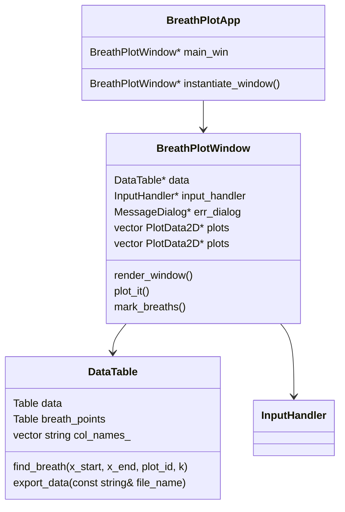

# BreathDet

BreathDet is a simple program for viewing breath data, detecting breath start, peaks and their ends, and exporting these acquired data.

The main goal of the software project is to provide users with an easy-to-use tool
for automate the process of
* displaying breath data, e.g. of ventilator
* finding time offsets of each breath start, peak or end
* exporting gained data into a file.

In order to detect breaths, the method of least squares for regression is applied. While this may sound too simple,
the results are sufficiently accurate, and, what's more, the method's computation process is pure and fast.

# Requirements

* ``gtkmm-3.0+``

    * Linux (Arch Linux):

        ```
        pacman -S gtkmm
        ```
    The name of gtkmm package depends on distribution.
    * Microsoft Windows:
        - https://wiki.gnome.org/Projects/gtkmm/MSWindows   

* ``gtkmm-plplot`` - already in this repo, the building process explained below.
# Installation

First, you need to build plplot by running the following commands (on both Linux/Windows)

**Note:** you must first install meson and ninja building tools to execute this code.

Again, commands are specific for each Linux distribution, they should, however, be similar to the ones below:
```
yaourt -S gtkmm3-plplot
```
Visit https://tschoonj.github.io/gtkmm-plplot/installation_instructions.html for more information

On Windows, write the following commands to the Command Line or MSYS2 in gtkmm-plplot directory in this git directory:
```
mkdir build-msys2

cd build-msys2

/c/Program\ Files/CMake/bin/cmake -G "Unix Makefiles" -
DMINGW=1  -DCMAKE_INSTALL_PREFIX=yourinstallpath ../

make

make install
```

The next step is build the gtkmm-plplot library, this is done similarly but varies on different OS.

You can build the project simply by running (on Windows in again in Command Line or MSYS2)
```
tar xfvz gtkmm-plplot-2.5.tar.gz
cd gtkmm-plplot-2.5
mkdir build ; cd build
meson
ninja
ninja install
```

# Input/Output

Though not necessary, you can configure sensitivity of breath detection by modifying ``config.txt`` file, its format is as follows:
```
Breath_start_min_tangent    Breath_start_max_tangent
Breath_end_min_tangent      Breath_end_max_tangent
Breath_peak_min_tangent     Breath_peak_max_tangent
```

The variables above specify the value of the tangent ``a`` in eqution ``y=ax + b`` for the tangent of the plot and given point on it. Presence of the max value for each type is necessary to prevent incorrect detection.

## Input Format
```
% Column Names separated by whitespace
% Units of the variables in columns
# (DATA below as double values- not written in a file,
# just a comment)
double double double double double ... 
double double double double double ...
double double double double double ...
double double double double double ...
```

Names of column may vary as you can change in the input file. The example below captures output of one of the samples given in tests directory.

## Output (Plots)

* **l/s** plot- shows actual flow of breath, which is positive when inhaling, and negative when exhaling.
* **l** - The same as above, but different measure techniques used.
* **cm_H20** - This plot captures the amount of air in the lungs while inhaling/exhaling. It is this plot which is most suitable for breath detection, since its graph is easy to analyse with basic knowledge of linear algebra.
* Same as above, different units used however.

## Output (Exported file)

# Technical details


